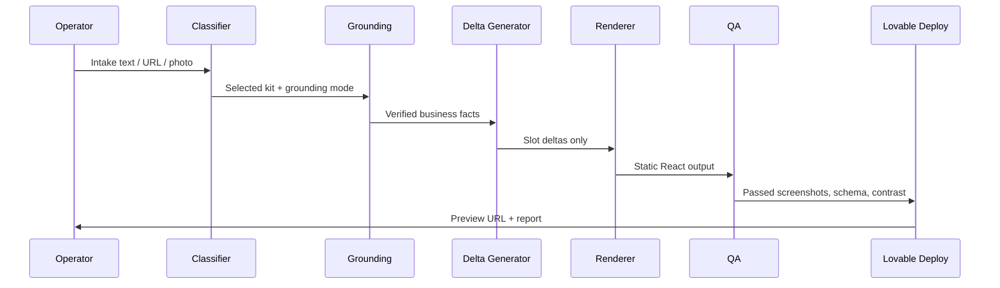

# Kit Library and Remix Engine Spec

Rocket Site Factory should beat Lovable by reusing high-quality parameterized kits and only spending paid API calls on the parts that actually need to change: business grounding, copy deltas, hero media, schema, logo treatment, and QA.

## Kit Type

```ts
export type Vertical =
  | "plumber"
  | "hvac"
  | "roofer"
  | "landscaper"
  | "electrician"
  | "painter"
  | "pool"
  | "concrete"
  | "tree"
  | "property"
  | "auto"
  | "generic";

export type KitTier = 1 | 2 | 3;
export type CostClass = "cheap" | "standard" | "premium";
export type GroundingMode = "firecrawl-source" | "gbp-only" | "none";

export interface RocketKit {
  /** Stable id used in URLs, analytics, and cache keys. */
  id: string;
  slug: string;
  name: string;
  vertical: Vertical;
  tier: KitTier;
  layoutGrammar: Array<
    | "hero"
    | "trust"
    | "services"
    | "gallery"
    | "about"
    | "serviceArea"
    | "reviews"
    | "faq"
    | "contact"
    | "cta"
    | "footer"
  >;
  slots: {
    heroHeadline: string;
    heroSubhead: string;
    heroMedia: string;
    services: Array<{ title: string; body: string; image?: string }>;
    serviceAreas: string[];
    trustFacts: Array<{ label: string; value: string; verified: boolean }>;
    faqs: Array<{ q: string; a: string }>;
    contactCta: string;
  };
  palette: {
    primary: string;
    secondary: string;
    accent: string;
    neutralBase: string;
    glass: string;
    textHigh: string;
    textLow: string;
  };
  typography: {
    displayFamily: string;
    bodyFamily: string;
    displayScale: number;
    bodyScale: number;
    tracking: string;
  };
  motion: {
    heroEntry: string;
    sectionReveal: string;
    hover: string;
  };
  mediaRecipe: Record<string, "pexels" | "openai" | "veo" | "uploaded" | "static-illustration">;
  groundingMode: GroundingMode;
  qaThresholds: {
    lighthousePerformanceMin: number;
    lighthouseSeoMin: number;
    contrastMin: number;
    schemaValidatorsRequired: string[];
  };
  costClass: CostClass;
  version: number;
}
```

## First Kit Catalog

| Kit ID | Vertical | Tier | Aesthetic | Notable Slots | Cost |
|---|---:|---:|---|---|---|
| pl-fl-coastal-1p | plumber | 1 | coastal blue, white glass | emergency CTA, drain/service cards | cheap |
| pl-industrial-5p | plumber | 2 | navy, steel, orange | service detail pages, coupons | standard |
| hvac-mountain-pro-1p | hvac | 1 | alpine navy, brass | comfort promise, seasonal CTA | cheap |
| hvac-utility-5p | hvac | 2 | technical graphite | repair/install/maintenance pages | standard |
| roof-texas-storm-1p | roofer | 1 | storm dark, amber | insurance claim CTA | cheap |
| roof-premium-5p | roofer | 2 | architectural black | gallery, roof types | standard |
| land-organic-1p | landscaper | 1 | moss, stone, cream | before/after gallery | cheap |
| land-estate-5p | landscaper | 2 | editorial green | maintenance plans | standard |
| elec-signal-1p | electrician | 1 | black, neon cyan | safety/troubleshooting CTA | cheap |
| elec-commercial-5p | electrician | 2 | slate, safety yellow | commercial/residential split | standard |
| paint-interior-1p | painter | 1 | warm white, pigment swatches | rooms, cabinets, exteriors | cheap |
| paint-luxury-5p | painter | 2 | gallery white | finish guide, project gallery | standard |
| pool-desert-1p | pool | 1 | aqua, sand, dusk | weekly route CTA | cheap |
| pool-resort-5p | pool | 2 | resort blue | service plans, repairs | standard |
| concrete-modern-1p | concrete | 1 | charcoal, limestone | slabs, patios, driveways | cheap |
| concrete-builder-5p | concrete | 2 | contractor orange | commercial/residential pages | standard |
| tree-canopy-1p | tree | 1 | canopy green | emergency removal CTA | cheap |
| tree-forestry-5p | tree | 2 | deep forest | lot clearing, stump grinding | standard |
| prop-clean-1p | property | 1 | trust blue, warm gray | rentals/management CTA | cheap |
| auto-garage-1p | auto | 1 | asphalt, red, chrome | repair menu, booking CTA | cheap |

Expand this to 50-60 kits by adding regional variants and Tier 3 cinematic versions.

## Cheap Classifier

Rules first. Tiny model fallback only if confidence is below `0.7`.

```ts
function chooseKit(input: Intake): KitChoice {
  const vertical = normalizeVertical(input.industry, input.businessName, input.sourceText);
  const region = normalizeRegion(input.city, input.state);
  const tier = input.requestedPages >= 5 || input.existingSiteUrl ? 2 : 1;
  const aesthetic = pickAesthetic(vertical, region, input.sourceSitePalette);
  const match = findKit({ vertical, tier, aesthetic });

  if (match.confidence >= 0.7) return match;
  return tinyModelFallback(input, availableKits); // target <$0.005/site
}
```

## Remix Engine

```ts
export async function buildSiteFromKit(input: {
  business: BusinessIntake;
  kitId?: string;
  sourceUrl?: string;
  costClass?: CostClass;
  publish?: boolean;
}): Promise<{
  siteId: string;
  kitId: string;
  previewUrl: string;
  qa: QaResult;
  costs: CostLedger;
}> {
  // hydrate -> ground -> generate deltas -> render -> QA -> deploy
}
```



## Cache Strategy

- Source cache: `source:${businessSlug}:${sourceHash}` for 30 days.
- Vertical-city cache: `local:${vertical}:${city}:${state}` for 7 days.
- Kit render cache: `kit:${kitId}:v${version}:${slotsHash}` until kit version changes.

Example: 10 Orlando plumbers share one local SERP/local-pack request instead of ten. At $0.05 per SERP bundle, that is $0.05 instead of $0.50 for the pack.

## Migration Plan

Sprint A:

- Create `packages/kits`.
- Port existing 8 bulk templates into kits.
- Build `/cockpit/templates`.
- Add kit preview cards.

Sprint B:

- Build classifier.
- Wire classifier into intake and queue.
- Add render cache.
- Add QA screenshots.

Sprint C:

- Author kits 9-60.
- Add cinematic hero provider routing.
- Add client admin editing.
- Add bulk run cost ledger.
